<div align="center">



<br>

# 📈 EzyMap ALGO

**A trading desk that lives inside Telegram — and a website that proves it works.**

Signals, a macro desk, gated ebooks and an AI autopilot, sold through guest-friendly
Stripe checkout and delivered to a Telegram account the buyer never has to type.

<br>

[](https://printezy.money)
[](https://printezy.money/ezyai?tab=live)
[](https://t.me/EzyRegisterBot)
[](https://github.com/sponsors/printezy247)


</div>

<br>

## 📟 Telemetry

Every number on this page is counted from the code, and the third column says where.

| Channel              | Reading                                                                          | Read from                                                                            |
| -------------------- | -------------------------------------------------------------------------------- | ------------------------------------------------------------------------------------ |
| **Routes**           | `31` registered paths — 24 rendered pages, 4 API, 2 redirects, 1 XML             | [`src/routeTree.gen.ts`](./src/routeTree.gen.ts)                                     |
| **Malay twins**      | `9` — one per English public page, 1:1                                           | [`src/routes/ms/`](./src/routes/ms) ↔ `LOCALIZED_PATHS`                              |
| **Migrations**       | `33`                                                                             | [`supabase/migrations/`](./supabase/migrations)                                      |
| **Tables**           | `22`, none readable by `anon`; 6 user-owned tables allow a self-scoped read      | [`src/integrations/supabase/types.ts`](./src/integrations/supabase/types.ts)         |
| **RPC**              | `4` — `analytics_summary`, `has_role`, `increment_rate_limit`, `record_ad_click` | same file                                                                            |
| **Server functions** | `37` exported (plus one unused Lovable scaffold)                                 | [`src/lib/`](./src/lib) — `*.functions.ts`                                           |
| **Catalog**          | `30` SKUs in 5 groups                                                            | [`src/lib/catalog.ts`](./src/lib/catalog.ts)                                         |
| **Locales**          | `6 × 561 = 3,366` strings, checked by the compiler                               | [`src/lib/translations.ts`](./src/lib/translations.ts)                               |
| **Reply book**       | `29` entries × 6 languages                                                       | [`src/lib/bot/`](./src/lib/bot) — `replies*.ts`                                      |
| **Rate limiter**     | `6` keys, bucketed on caller **and** IP                                          | [`src/lib/rate-limit.server.ts`](./src/lib/rate-limit.server.ts)                     |
| **Board refresh**    | `60s`, public, no account                                                        | [`src/routes/ezyai.tsx`](./src/routes/ezyai.tsx)                                     |
| **Ingest batch**     | `≤ 50` signals · `200` / `207` / `400`                                           | [`src/routes/api/public/ezyai/signals.ts`](./src/routes/api/public/ezyai/signals.ts) |
| **TG login replay**  | `15 minutes`                                                                     | [`src/lib/telegram-login.server.ts`](./src/lib/telegram-login.server.ts)             |
| **Portal session**   | `7 days` from the bot (the token travels in a URL), `30` in browser              | `LINK_SESSION_TTL_DAYS`, `src/lib/bot/member.server.ts`                              |
| **Ebook URL**        | `1 hour`, signed, private bucket                                                 | [`src/lib/ebook-claims.functions.ts`](./src/lib/ebook-claims.functions.ts)           |
| **Sitemap**          | `20` `<url>` entries, generated                                                  | [`src/routes/sitemap[.]xml.ts`](./src/routes/sitemap%5B.%5Dxml.ts)                   |
| **Members**          | live from Telegram `getChatMemberCount`, 6h cache, `640` only as fallback        | [`src/lib/member-count.functions.ts`](./src/lib/member-count.functions.ts)           |

---

## 📡 The board — the proof



[`/ezyai`](https://printezy.money/ezyai?tab=live) is **public on purpose**. Anyone can watch the
desk work, which is the proof that sells PRO. The paywall stays where it always was — inside the
bot, on the alerts that arrive while a trade is still worth taking.

**What a card shows.** Status, entry zone, SL, TP1/TP2, R:R and the setup score. The rail under
each card maps the last reported price onto the stop → target span, so both directions read
left-to-right and "further right is better" whichever way the trade points. A card stays on the
board until the trade actually closes at target, break-even or stop — nothing is quietly removed.

**Deep links.** `?tab=live` · `?tab=history` · `?tab=about` — displayed as _Live signals_,
_Performance_ and _About EzyAI_.

**And the arithmetic is deliberately unflattering:**

- `winRate = wins / (wins + losses)`. Break-even is **excluded from the denominator**, not counted
  as half a win, so the number cannot be inflated by moving stops to entry.
- A break-even **ends** a streak rather than extending it.
- `liveR()` is derived from the last reported price and **never stored**, so a stale row can never
  display a stale profit.
- `progressPercent()` returns `null` when the levels are missing — the card shows an indeterminate
  bar rather than a made-up position.
- `cancelled` is never counted in performance.
- Six statuses, enforced in three places: a TypeScript const tuple, the ingest validator, and a
  Postgres `CHECK` constraint.

---

## 🧭 System


Four trust boundaries the diagram implies but cannot draw:

- **No Stripe API key or bot token is used for outbound calls** — those route through Lovable's
  connector gateway on connection keys. The two secrets app code does handle are the Stripe webhook
  signing secret and `TELEGRAM_LOGIN_BOT_TOKEN`, both used only to verify inbound signatures.
- Because the Stripe SDK is proxied, the webhook signature is verified **by hand** with WebCrypto
  HMAC-SHA256: 300-second timestamp tolerance, constant-time compare across every `v1` signature.
- The Telegram webhook secret is **derived, not stored**:
  `base64url(SHA-256("telegram-webhook:" + key))`. The route derives it from `TELEGRAM_API_KEY`;
  whoever calls `setWebhook` (done by hand against the gateway, not from this repo) derives the same
  value, so there is nothing extra to rotate.
- Two independent env guards mean a sandbox Stripe event can never grant live access.

---

## 🧱 Stack

| Piece                                                       | What it does                                                                              |
| ----------------------------------------------------------- | ----------------------------------------------------------------------------------------- |
| **[TanStack Start](https://tanstack.com/start)** (React 19) | File-based routing, server functions, SSR                                                 |
| **[Supabase](https://supabase.com)**                        | Postgres, Auth, and the tables behind leads, checkout, ebook claims, referrals, analytics |
| **[Stripe](https://stripe.com)**                            | Checkout via Lovable's connector gateway — no raw secret keys committed                   |
| **Tailwind CSS v4** + **shadcn/ui**                         | UI, on Radix primitives                                                                   |
| **Framer Motion**                                           | Page and section motion, respects `prefers-reduced-motion`                                |
| **bun**                                                     | The project's real package manager (`bun.lock`)                                           |

---

## 🚀 Run it

```bash
bun install

bun run dev        # vite dev — http://localhost:8080
bun run build      # production build
bun run build:dev  # build with development mode config
bun run preview    # serve the built output
bun run lint       # eslint
bun run format     # prettier --write .
```

`.env`, `.env.development` and `.env.production` are all tracked and carry only publishable
keys, so a fresh clone runs with nothing to copy. The server-side variables — Stripe, the
Supabase service role, the Telegram and MT5 licence tokens, the Meta and MacroTrader keys — live
in the deploy environment and are never in the repo.

---

## 💛 Sponsor

Everything above runs on free public data feeds and a single small Cloudflare Worker. No paid
market API, no scraped terminal, no ghost-written track record — the signal board is fed by the
same autopilot that trades the maintainer's own account, and the win rate on `/ezyai` counts
break-even trades honestly rather than the flattering way.

If that is the sort of thing you would like more of, sponsorship goes to the parts that cost
money rather than the parts that are fun:

| What                                    | Why it costs                                                                                                                                                                                                                            |
| --------------------------------------- | --------------------------------------------------------------------------------------------------------------------------------------------------------------------------------------------------------------------------------------- |
| 📡 **A calendar feed we may depend on** | The desk reads TradingView's public widget endpoint first because it is the one that carries the released `actual`. It is not a licensed API and it can close without notice; the ForexFactory fallback never carries an actual at all. |
| 🖥️ **A dedicated VPS for the bots**     | Four Telegram bots on one hobby box is a single point of failure for every delivery on this list.                                                                                                                                       |
| 🌍 **Native translators**               | Six locales ship today; four of them were translated by a machine and deserve a human pass.                                                                                                                                             |
| 🧪 **A staging Supabase project**       | All 33 migrations here are applied to production because there is nowhere else to apply them.                                                                                                                                           |

<div align="center">

<br>

[](https://github.com/sponsors/printezy247)
[](https://t.me/ezymap)

<sub>Or just open the board and watch it work — that costs nothing and helps most.</sub>

</div>

---

## 🎛️ Console — operator reference

Eleven channels. Open the one you are about to touch. The index below stays in open text, because
browser find-in-page does not reach inside a closed `<details>`.

| Channel                    | Open it when                                      | Files & symbols                                                               |
| -------------------------- | ------------------------------------------------- | ----------------------------------------------------------------------------- |
| `CH 01` · Project map      | You need the file that does a thing               | `src/routes/`, `src/lib/`, `supabase/migrations/`                             |
| `CH 02` · Checkout         | A sale did not deliver                            | `createCheckout`, `MT5_SKU_MAP`, `normalizeRedeemCode`, `site_purchases`      |
| `CH 03` · Accounts         | Someone cannot sign in, or has two accounts       | `safePath()`, `member_sessions`, `profiles.telegram_id`                       |
| `CH 04` · Telegram sign-in | The login button renders nothing                  | `telegram-login.server.ts`, `TELEGRAM_LOGIN_BOT_TOKEN`                        |
| `CH 05` · The bot          | A command, a callback or a chat answer misbehaves | `src/lib/bot/`, `replies.ts`, `escapeHtml`, `toWeb()`                         |
| `CH 06` · Signal bridge    | You are wiring an autopilot to the board          | `/api/public/ezyai/signals`, `ezyai_signals`, `docs/ezyai_signal_client.py`   |
| `CH 07` · PRO entitlements | A paid PRO buyer has no PRO                       | `ezyai_entitlements`, `claimEntitlement`, `escapeLikePattern`                 |
| `CH 08` · Macro desk       | A calendar or desk card is stale, empty or seeded | `macro-calendar.functions.ts`, `macro-desk.ts`, `macro_calendar_cache`        |
| `CH 09` · Ebooks & support | A claim is stuck, or Sarah is not receiving       | `sarah_chat_id`, `sarah_send_health`, `ebook_claims`                          |
| `CH 10` · Six locales      | You are adding a key, a page or a language        | `TranslationKey`, `LOCALIZED_PATHS`, `translations.ts`                        |
| `CH 11` · Security posture | You are reviewing the blast radius                | `increment_rate_limit`, RLS policies, `20260905200000_security_hardening.sql` |

<details>
<summary><b><code>CH 01</code> · Project map</b> — where each subsystem lives, linked rather than drawn as a tree that goes stale</summary>

<br>

| Directory                                                   | What is in it                                                                               |
| ----------------------------------------------------------- | ------------------------------------------------------------------------------------------- |
| [`src/routes/`](./src/routes)                               | 33 route files — 9 under `ms/`, 4 under `api/public/`. Conventions: `src/routes/README.md`  |
| [`src/components/`](./src/components)                       | `landing/` (incl. `LiveSampleSignal.tsx`), `ezyai/` (cards + performance), `brand/`, modals |
| [`src/lib/`](./src/lib)                                     | 37 server functions (`*.functions.ts`) plus the isomorphic logic they call                  |
| [`src/lib/bot/`](./src/lib/bot)                             | The Telegram brain: menu, enrollment, purchases, replies, Sarah, MT5 licences               |
| [`src/lib/ezyai/`](./src/lib/ezyai)                         | Board types and arithmetic, entitlements, redeem codes                                      |
| [`src/integrations/supabase/`](./src/integrations/supabase) | Generated `types.ts` and the two clients (service-role admin, per-request RLS)              |
| [`supabase/migrations/`](./supabase/migrations)             | 33 SQL migrations, applied in Supabase's SQL editor — no CI migration runner                |
| [`docs/`](./docs)                                           | `ezyai_signal_client.py` and the README's SVG assets                                        |
| [`src/server.ts`](./src/server.ts)                          | The Cloudflare Worker entry: security headers, SSR error normalisation                      |

Two routes render nothing on purpose: `/pricing` is a **301 to `/`** (fragments never reach the
server, so `/pricing#sku` still lands as `/#sku` for browsers while crawlers get a real redirect),
and `/free-ebook` redirects to `/ebooks/technical-analysis`.

> ⚠️ bun only. `package-lock.json` is in `.prettierignore` but **not** in `.gitignore`, so nothing
> but this sentence stops it being committed. That is a gap, stated as one.

</details>

<details>
<summary><b><code>CH 02</code> · Checkout and fulfilment</b> — guest Stripe checkout, <code>createCheckout</code>, and the auto-grant path through the MT5 licence server</summary>

<br>

**No account required to buy.** `createCheckout` (`src/lib/checkout.functions.ts`) validates the
SKU against [`catalog.ts`](./src/lib/catalog.ts), the `origin` against an explicit allow-regex, the
Telegram handle against `^[A-Za-z0-9_]{5,32}$`, and **requires an MT5 account number when
`item.group === "mt5"`**.

It then resolves the SKU to a Stripe Price **by `lookup_key`, creating the Price on first sale if
it does not exist** — adding a SKU to `catalog.ts` is genuinely the only setup step. Mode is
`payment`, not `subscription`: every price is a one-time charge for a stated term, so "$19/mo" in
the macro UI is a term label, not a Stripe subscription.

**Idempotency** is by unique `stripe_session_id`: `recordSitePurchase` re-reads the row before
inserting, so a Stripe retry records the sale once.

**Fulfilment is automatic, not manual.** `site-access.server.ts` creates the enrollment and DMs the
buyer. For MT5 SKUs, `mt5-license.server.ts` POSTs `/admin/grant` to the EzyMap License Server with
`{account, product, tier}` — **18 SKUs → 6 products × 3 tiers through an explicit map**, keyed by
MT5 account number so one compiled `.ex5` per tool serves every customer. The map is deliberately
not parsed from the SKU string, so the two vocabularies can diverge without a silent mismatch. If
the licence server is unconfigured it is a silent no-op that falls back to manual fulfilment; it
never throws and never blocks the purchase confirmation.

🎟️ **Redeem codes** (`EZY-XXXX-XXXX`, `src/lib/ezyai/redeem-code.ts`) are minted at checkout **for
the three `ezyai_pro_*` SKUs** and stored on the Stripe session metadata _and_ in the payment
description, so the success page, the Stripe receipt and the entitlement row all carry the same
code. The alphabet is 32 symbols with no
`O`, `I`, `0` or `1`, so a code cannot be mis-read off a printed receipt; `normalizeRedeemCode()`
folds `O→0` and `I→1` and makes the prefix and dashes optional.

</details>

<details>
<summary><b><code>CH 03</code> · Accounts</b> — <code>/auth</code> offers three sign-in paths, and <code>/dashboard</code> and <code>/account</code> are two different identity systems</summary>

<br>

`/auth` offers **three** paths: Google OAuth, a Supabase email magic link, and the Telegram Login
Widget (see `CH 04`). `safePath()` rejects any post-login redirect that is not a same-origin path,
so `//evil.com` cannot be smuggled through the `redirect` parameter.

| Page         | Identity                                                | What it holds                                                                     |
| ------------ | ------------------------------------------------------- | --------------------------------------------------------------------------------- |
| `/dashboard` | Supabase account, keyed on the **email** Stripe charged | `site_purchases`, ebook claims with download buttons, referral link, profile form |
| `/account`   | Telegram member portal, keyed on **Telegram id**        | Signals filtered by highest active tier, a trade journal, billing history         |

Portal sessions last 30 days in the browser, but every "My account" link the bot sends mints a
**7-day** `member_sessions` row instead, because that token travels in a URL. The route consumes
`?s=<token>` and immediately `history.replaceState()`s it out of the address bar. The permanent
`enrollments.portal_token` is only a Stripe correlation id and is no longer accepted as a
credential.

> ⚠️ Supabase Auth → URL configuration must allow `https://printezy.money/**` and the Lovable
> preview hosts as redirect URLs, because sign-in returns deep links such as
> `/ebooks/<slug>?claim=1`.

<details>
<summary>🎨 <b>Making the Google consent screen say "EzyMap ALGO"</b></summary>

<br>

The name on that screen comes from the OAuth client, not from this repo. Without your own client,
Google shows the raw `<project-ref>.supabase.co` host.

1. Verify `printezy.money` in Google Search Console.
2. Google Cloud Console → **Google Auth Platform** → **Branding**: app name, logo,
   home/privacy/terms URLs, and `printezy.money` as an authorized domain.
3. **Audience** → External, then Publish.
4. **Clients** → create a Web application client with redirect URI
   `https://<project-ref>.supabase.co/auth/v1/callback`.
5. Paste that client id and secret into Lovable Cloud → Auth → Google.

Sign-in only needs the non-sensitive `openid`, `userinfo.email` and `userinfo.profile` scopes, so
no verification review is required. Uploading a logo does trigger one, though sign-in keeps working
while it is pending.

</details>

</details>

<details>
<summary><b><code>CH 04</code> · Telegram sign-in</b> — four surfaces, one identity Telegram signs for, verified in <code>src/lib/telegram-login.server.ts</code></summary>

<br>

| Where               | What it does                                                                                                                         |
| ------------------- | ------------------------------------------------------------------------------------------------------------------------------------ |
| `/auth`             | A third sign-in option beside Google and email. See the two outcomes below.                                                          |
| `/account`          | One-click sign-in, above the 6-digit code flow. Claims anything already paid for under that handle.                                  |
| `/checkout-success` | "Deliver it to the right account" — attaches the purchase to a verified account, by Stripe session id, with no handle in the middle. |
| `/dashboard`        | A card that links Telegram to the website account and claims every purchase on it.                                                   |

**The verification.** HMAC-SHA256 over Telegram's sorted data-check-string, keyed on
`SHA256(bot_token)`, compared in constant time, with payloads older than **15 minutes** rejected —
Telegram never expires these, so without a window a captured payload is replayable forever.
`photo_url` is dropped unless it is already `https://` (and clamped to 500 chars), and the
username re-validated against `^[A-Za-z0-9_]{3,32}$`.
Every rejection is silent, so a forgery and an expiry look identical from outside.

The button renders only when a sign-in could actually be verified, and it removes itself if
Telegram's script fails to load — a missing `/setdomain` degrades to the old flow rather than to a
dead end. Code: `telegram-login.server.ts`, `telegram-login.functions.ts`,
`src/components/TelegramLoginButton.tsx`.

> ⚠️ **Two manual steps, or the button does nothing.** Both are for the _same_ bot — by default
> `@EzyRegisterBot`, the one that owns `bot_users` and delivers access.
>
> 1. **BotFather → `/setdomain` → `printezy.money`.** Telegram refuses to render the button on a
>    domain the bot has not claimed. Nothing appears, no error.
> 2. **`TELEGRAM_LOGIN_BOT_TOKEN`** in Lovable Cloud, set to that bot's token. The rest of the bot
>    code never sees a raw token — the connector gateway injects it — but signature verification
>    cannot work without it.
>
> Optional: `TELEGRAM_LOGIN_BOT_USERNAME` if the login bot is not `@EzyRegisterBot`. Until the
> token is set, `getTelegramLoginConfig` returns `botUsername: null` and no button is rendered
> anywhere.

<details>
<summary>📐 <b>Why it is built this way</b> — the design record</summary>

<br>

Everything this site sells is delivered **inside Telegram**, and for a long time the only thing
tying a payment to a Telegram account was the handle the buyer typed at checkout. One typo, one
later rename, or an account with no username at all, and the purchase sat in `site_purchases` with
`granted_at` still null while the buyer waited on support. The Login Widget replaces that typed
string with an id Telegram signs for.

Telegram issues no email, and website accounts are keyed on one — every purchase is matched to an
account by the address Stripe charged. Minting an account from a Telegram id would mean inventing
an email, and the buyer would end up with two accounts: the invented one they signed in to, and the
real one their purchases landed in. So **`/auth` never creates an account.** It resolves one of two
ways:

- **Linked** (`profiles.telegram_id` matches a website account) → a real Supabase session for that
  account, and on to `/dashboard`. The token handed to the browser is the same one a magic link
  carries in its URL, issued only after Telegram's signature proved ownership.
- **Not linked yet** → a member-area session instead, and on to `/account`, which is keyed on
  Telegram anyway. Linking is offered on the dashboard, which is what turns a visitor into the
  first case next time.

</details>

</details>

<details>
<summary><b><code>CH 05</code> · The bot and the reply book</b> — 14 commands, 8 callback namespaces, and one 29-entry reply engine serving both Telegram and the site's chat widget</summary>

<br>

`@EzyRegisterBot` is served by `POST /api/public/telegram/webhook`. All calls go out through the
Lovable connector gateway, so **the bot token is never handled by app code**, and the webhook
secret is _derived_ rather than stored: `base64url(SHA-256("telegram-webhook:" + TELEGRAM_API_KEY))`
— the route derives the secret from `TELEGRAM_API_KEY`, and whoever calls `setWebhook` (a manual
step against the gateway, not code in this repo) derives the same value, so there is no extra secret
to rotate.

- **14 commands**, aliases included — `/start`, `/packages`, `/products`, `/enroll`, `/status`,
  `/account`, `/dashboard`, `/ask`, `/sarah`, `/end`, `/language`, `/bahasa`, `/faq`, `/help` — and
  **8 callback-data namespaces**: `kw:`, `trial:`, `buy:`, `sarah:`, `vantage:`, `ebook:`, `tier:`,
  `menu:`.
- Every outbound message is `parse_mode: HTML` with `escapeHtml()` over all user-supplied text.
- `ebook:approve:` is re-checked against `getSarahChatId()` because `callback_data` is
  client-controlled.
- Any handler exception still returns **200**, so a logic bug cannot make Telegram hammer retries.

**The reply book is one engine, two surfaces.** 29 entries; `en`/`ms` are the source of truth and
`zh`/`hi`/`ar`/`sw` are translation layers keyed by entry id that inherit every URL, keyword and
product reference and swap only the visible text. The matcher scans trigger phrases in **all six
languages simultaneously, longest phrase wins**, so `tradingview pro` beats `pro` and a Malay
question typed on the English site still gets a Malay answer. `toWeb()` strips the HTML and turns
Telegram inline keyboards into web links and quick-reply chips, so the site widget answers exactly
as the bot does. An untranslated entry falls back to English, never to a blank.

</details>

<details>
<summary><b><code>CH 06</code> · The signal bridge API</b> — <code>POST /api/public/ezyai/signals</code>, one merge keyed on <code>external_id</code>, batches of 50 answering 200 / 207 / 400</summary>

<br>

```
POST /api/public/ezyai/signals      Authorization: Bearer <EZYAI_SIGNAL_KEY>
```



Three shapes, all the same call. Every field except `external_id` is optional on an update
(`symbol` is also required on the first push that creates a card), and a field the payload omits
keeps whatever it already had:

```jsonc
// open
{ "external_id": "auto-8842", "symbol": "XAUUSD", "direction": "buy",
  "status": "pending", "setup": "London continuation", "timeframe": "M15",
  "entry_low": 4590.2, "entry_high": 4593.0, "stop_price": 4585.0,
  "tp1": 4604.0, "tp2": 4612.0, "rr": 2.4, "setup_score": 82 }

// tick — as often as you like while it runs
{ "external_id": "auto-8842", "status": "running", "last_price": 4597.1 }

// close
{ "external_id": "auto-8842", "status": "tp", "result_r": 2.4, "result_pips": 138 }
```

| Field         | Notes                                                                        |
| ------------- | ---------------------------------------------------------------------------- |
| `external_id` | The bot's own id for the trade. Makes every push idempotent.                 |
| `status`      | `pending` · `running` · `tp` · `be` · `sl` · `cancelled`                     |
| `direction`   | `buy` · `sell`                                                               |
| `setup_score` | 0–100, rendered as the ring on the card                                      |
| `result_r`    | Realised R: `+2.4` at target, `-1` at stop. Drives every performance number. |
| `closed_at`   | Filled in automatically on a closing status if omitted                       |

Text fields are length-clamped (`external_id` 120, `symbol` 32, `setup` 120, `timeframe` 16, `note`
400), `symbol` is uppercased, `direction` and `status` are lowercased and validated against the
tuples, and `setup_score` is rounded and range-checked.

**A ready-made client is in this repo:** [`docs/ezyai_signal_client.py`](./docs/ezyai_signal_client.py).
275 lines, standard library only, so it adds no dependency to the bot:

```python
from ezyai_signal_client import open_signal, tick, close_signal

open_signal("auto-8842", "XAUUSD", "buy", status="running",
            entry_low=4590.2, entry_high=4593.0, stop_price=4585.0,
            tp1=4604.0, tp2=4612.0, rr=2.4, setup_score=82,
            setup="London continuation", timeframe="M15")

tick("auto-8842", 4597.1)                        # while it runs

close_signal("auto-8842", "tp", result_r=2.4)    # at target / break-even / stop
```

Nothing in it raises: a failed push returns `ok=False` and logs, because the board is a shop window
and must never be able to take the bot down with it. Running the file directly fires a probe signal
and cancels it again, which is the quickest way to prove the key works.

Batch up to **50** with `{ "signals": [ ... ] }`. A mixed batch answers **207** with a per-signal
`results` array, so one malformed row cannot lose the other forty-nine; **200** when all are
accepted, **400** when none are. `GET` the same URL (authenticated) returns the live board for
reconciliation.

The ingest is an explicit **update-or-insert, not an upsert**: Postgres builds the candidate row and
checks its NOT NULL columns _before_ it notices the conflict, so an upsert of a price tick — which
carries no `symbol` — is rejected even though the row it means to update already exists. A `23505`
from a concurrent insert is retried as the update it should have been, rather than being lost.

> ⚠️ Set **`EZYAI_SIGNAL_KEY`** in Lovable Cloud. It falls back to `EZYAI_ENTITLEMENT_KEY` if
> unset, so the bridge works with one secret and can be split onto its own later without a code
> change. While neither is set the endpoint answers 503 and the board simply stays empty.
>
> Secrets bind at **deploy** time, not at save time — a key added after the last deploy is not in
> the running site's environment until the project deploys again.

<details>
<summary>🩺 <b>When the key is refused</b> — <code>?diagnose=1</code>, the 401 body, and the symptom matrix</summary>

<br>

Open this in a browser — no key, no tooling, nothing secret comes back:

```
https://printezy.money/api/public/ezyai/signals?diagnose=1
```

```jsonc
{
  "configured": true,
  "compared_against": "EZYAI_SIGNAL_KEY", // ← the variable actually being checked
  "signal_key_present": true,
  "entitlement_key_present": true,
  "expected_fingerprint": "118ccb6a", // first 4 bytes of SHA-256
  "entitlement_fingerprint": "6b0f21ac",
  "keys_identical": false, // one secret pasted into both fields, then half-rotated
}
```

A **401** carries a different, smaller set — the variable compared, and a fingerprint of each side,
so the two can be compared without either being printed:

```jsonc
{
  "error": "unauthorized",
  "compared_against": "EZYAI_SIGNAL_KEY",
  "expected_fingerprint": "118ccb6a",
  "presented_fingerprint": "9d41e07b",
}
```

| What you see                                | What it means                                                        |
| ------------------------------------------- | -------------------------------------------------------------------- |
| `"signal_key_present": false`               | The signal key is not in the deployed environment — **deploy again** |
| `compared_against: "EZYAI_ENTITLEMENT_KEY"` | The fallback is doing the work; the signal key never arrived         |
| `"keys_identical": true`                    | One secret in both fields — rotating one leaves the other stale      |
| Fingerprints differ                         | Two different secrets — the bot's copy is stale, or was re-generated |
| `"presented_fingerprint": "none"`           | No `Authorization: Bearer …` header reached the site                 |
| 503                                         | Neither variable is bound at all                                     |

`diagnose` runs **before** the auth guard, deliberately: it exists for the case where auth is
exactly what is broken. It reveals no value and no length — 32 bits of a digest is far too little to
invert, and a colliding string still fails the real comparison.

Surrounding whitespace and one matched pair of quotes are stripped from both sides before
comparing, so a secret pasted into a dashboard as `"abc"` still authenticates a bot sending `abc`.

</details>

</details>

<details>
<summary><b><code>CH 07</code> · EzyAI PRO entitlements</b> — three <code>ezyai_pro_*</code> SKUs, one row per sale, <code>claimEntitlement</code> guarded on <code>claimed_at IS NULL</code></summary>

<br>

`ezyai_pro_{1m,6m,1y}` go through the same guest Stripe checkout as every other product. The
webhook records the `site_purchases` row, then writes one `ezyai_entitlements` row **keyed on the
unique `stripe_session_id`**, so a repeated GET can never grant a second period.
`recordEzyAiEntitlement` catches the `23505` and re-reads the winning row, which is the webhook and
the success page resolving at the same moment.

`@ezytradeai_bot` pulls unclaimed rows for a handle from
`GET/POST /api/public/ezyai/entitlements` (bearer key `EZYAI_ENTITLEMENT_KEY`, the same value as the
bot's `EZYAI_SITE_KEY`), activates PRO locally, then POSTs the claim back. `claimEntitlement` only
flips rows `WHERE claimed_at IS NULL`, so a bot retry after a crash cannot double-claim, and handle
lookups run through `escapeLikePattern()` so `%` and `_` cannot be injected into the `ilike`.

A buyer whose handle did not match sends `/redeem <code>` to the bot, which looks the row up with
`GET /api/public/ezyai/entitlements?code=<code>`. See `src/lib/ezyai/entitlements.server.ts`.

> ⚠️ Stripe needs one Price per SKU with `lookup_key` = SKU, in both sandbox and live — though
> `createCheckout` creates it on the first sale if it is missing.

</details>

<details>
<summary><b><code>CH 08</code> · Macro desk data</b> — TradingView is the primary calendar provider because it is the one that carries <code>actual</code>; ForexFactory is the fallback</summary>

<br>

`src/lib/macro-calendar.functions.ts` runs **two providers in order**:

| Order | Provider                                               | Carries `actual`?                            |
| ----- | ------------------------------------------------------ | -------------------------------------------- |
| 1     | TradingView's economic-calendar endpoint (9 countries) | **Yes** — which is exactly why it is first   |
| 2     | ForexFactory's weekly JSON                             | **No** — never, not even hours after release |

On the fallback provider the Actual column is **hidden rather than faked**, and rows are never
stitched across providers: a row's actual / forecast / previous always come from one source and
cannot disagree. TradingView sends raw numbers (`237000`), so `formatValue()` re-abbreviates to
K/M/B/T using the `unit` and `scale` fields, so the column reads the way ForexFactory prints it.
The TradingView request carries matching `origin`/`referer` headers; both providers use an 8-second
`AbortSignal.timeout` and a project-identifying user agent.

**Three independent graceful degradations, so the desk goes stale but never empty:**

- Each provider's raw payload is cached 1 hour in `macro_calendar_cache`; on a fetch failure the
  last good copy is served.
- The MacroTrader desk (`GET /api/desk`, env `MACRO_BOT_URL` + `MACRO_BOT_KEY`) is cached 3 hours
  and served **from cache even when the credentials go missing** — an explicitly documented fix for
  a prior outage.
- Crypto Fear & Greed is a keyless live read with a seeded fallback.

`src/lib/macro-desk.ts` says in its own header comment that everything outside the calendar and
Fear & Greed is still seed data, why (the MacroTrader bot exposes no public read API for heatmaps),
and that `fetchMacroDesk()` is the single swap point. Those cards are labelled "sample data" in the
UI too.

</details>

<details>
<summary><b><code>CH 09</code> · Gated ebooks and the support inbox</b> — a private bucket with 1-hour signed URLs, and one <code>sarah_chat_id</code> that self-registers once and then refuses to re-bind</summary>

<br>

The PDFs live in the private `ebooks` storage bucket (object key `<slug>.pdf`, see
`supabase/migrations/20260906090000_*`), not under `public/`. `getEbookDownloadUrl` hands a
signed-in user with an approved `ebook_claims` row a **one-hour signed URL**. Nothing else can read
the bucket.

📥 **To add a PDF:** drop it into the bucket in Lovable Cloud → Storage, then set `file` on the
`EBOOK_PAGES` entry.

🚦 **The approval gate.** Of the two ebook slugs, `technical-analysis` approves itself on claim;
`mapping-like-a-pro` is a real human gate: the visitor submits full name, Telegram handle and
Vantage account number, the row is saved `pending`, and `notifyVantageClaim`
(`src/lib/bot/ebook-claims.server.ts`) sends Sarah an
Approve button. Only her chat may act on the `ebook:approve:<claimId>` callback.

> ⚠️ That send is awaited, never fire-and-forget. The worker is torn down as soon as the response is
> returned, so an un-awaited notice is silently dropped.

**One numeric Telegram chat id**, `support_config.sarah_chat_id`, is the destination for everything
the site sends Sarah: website "Ask Sarah" relays, ebook approval requests, trial and purchase
requests, and referral-conversion notices. `autoRegisterSarah` (`src/lib/bot/sarah.server.ts`)
writes it the first time she messages the bot from `@ezysarah`, then **refuses to re-bind**, because
a released Telegram handle could otherwise be re-registered by someone else. Moving the inbox means
editing that row by hand.

<details>
<summary>🚨 <b>When a send fails</b> — the three surfaces that report it</summary>

<br>

Get that number wrong and Telegram rejects every send. This used to be invisible: the visitor still
read "Sent to Sarah" and nobody found out until someone went looking. Three surfaces now report it.

| Surface               | What you see                                                                      |
| --------------------- | --------------------------------------------------------------------------------- |
| 🖥️ Admin dashboard    | `/site-analytics` shows a red **Support inbox is not delivering** card            |
| 👤 Ebook claim screen | The visitor is offered a direct Telegram link instead of "Sarah will review this" |
| 🗄️ Database           | `support_config.sarah_send_health` holds the failing send, timestamp and error    |

`recordSarahSendFailure` writes that row. The next successful send calls `clearSarahSendFailure`,
and the card clears itself.

🔍 **Diagnosing a wrong id.** `support_messages.sarah_message_id` is `NULL` on every row while the
id is wrong, and populated once a send lands. Cross-check the value against `bot_users.telegram_id`
for `ezysarah`, which the webhook writes straight from a real Telegram update and is therefore
authoritative.

</details>

</details>

<details>
<summary><b><code>CH 10</code> · Six locales</b> — <code>TranslationKey</code> makes 3,366 strings a compile-time contract, and <code>/ms/*</code> are real URLs while the other four are a stored preview</summary>

<br>

`en` · `ms` · `zh` · `hi` · `ar` · `sw` — switcher in the nav, see `src/lib/i18n.tsx`.

`TranslationKey` is derived from the `en` block, so the type checker **rejects a build in which any
locale is missing any key**: 561 × 6 = 3,366 strings, a compile-time contract rather than a
dictionary.

`en` and `ms` follow the URL, because they have real `/ms/*` twins that crawlers need, and
reciprocal hreflang is emitted per route and in `/sitemap.xml`. `zh`/`hi`/`ar`/`sw` have no URL
anywhere and stay a stored client-side preview. Two resolution bugs the comments document, stated
as the reasons they exist:

- The stored preference is read once on mount **whatever the route**. Reading it only on
  non-localized paths made a stored `zh` get ignored on `/`, picked up on `/dashboard`, then leak
  back onto `/` — one page rendering in two languages depending on how you arrived.
- `setLocale` records the pick **before** navigating. Returning early for `en`/`ms` had made English
  literally unreachable once another language was stored.

Arabic flips `document.dir` to `rtl` for native bidi handling, while layout intentionally stays LTR.
Ebook page copy is localized via the `ms` field on each `EBOOK_PAGES` entry; the PDFs and the macro
desk data stay English.

📗 **Trading terms stay in English in every locale** — traders learn this vocabulary in English, and
translating it makes copy harder to follow, not easier.

| Left in English inside the translated sentence                                                                             | Why                                                                                                                    |
| -------------------------------------------------------------------------------------------------------------------------- | ---------------------------------------------------------------------------------------------------------------------- |
| `signal` · `entry` · `stop loss` · `take profit` · `target` · `setup` · `level`                                            | The words printed on the card the reader is looking at                                                                 |
| `support` · `resistance` · `breakout` · `trend` · `drawdown` · `position` · `chart` · `pip`                                | Chart vocabulary a trader already reads in English                                                                     |
| `scalp` · `intraday` · `swing` · `timeframe` · `indicator` · `macro` · `pair` · `forex` · `crypto`                         | Product and style names, identical across every broker                                                                 |
| `bullish`/`bearish` · `hawkish`/`dovish`                                                                                   | Market idiom with no single-word equivalent that reads right                                                           |
| **Not** converted: words with a second everyday meaning (Arabic `دعم` is also customer support, `دخول` is also signing in) | Translating them makes the sentence ambiguous                                                                          |
| **Not** converted: the `match` arrays in the reply-book layers                                                             | Those are the phrases a visitor actually types in their own language — translating them stops the bot recognising them |

Button labels are safe: `localize` keeps the English entry's keyword and URL and swaps only the
visible text.

</details>

<details>
<summary><b><code>CH 11</code> · Security posture</b> — no table readable by anon, six rate-limit keys on two axes, and <code>20260905200000_security_hardening.sql</code> as a published postmortem</summary>

<br>

**Row level security.** **No table in the 22 is openly readable by `anon`.** Seven
service-role-only tables carry `AS RESTRICTIVE ... USING (false) WITH CHECK (false)` plus
`REVOKE ALL` / `GRANT ALL TO service_role` applied in a `DO $$` loop. Six user-owned tables
(`site_purchases`, `ebook_claims`, `profiles`, `referral_codes`, `account_telegram_links`,
`user_roles`) get narrow self-scoped read policies for `authenticated`. `analytics_events` accepts a
constrained `anon` INSERT and denies reads. `storage.objects` carries a RESTRICTIVE policy denying
anon and authenticated on `bucket_id = 'ebooks'`. Every `SECURITY DEFINER` function is revoked from
`PUBLIC` and `anon`, and granted only to the role that calls it — `service_role` for
`analytics_summary`, `increment_rate_limit` and `record_ad_click`; `authenticated` for `has_role`,
which the RLS policies call as the signed-in user.

**Four independent constant-time comparisons, one hand-rolled HMAC.** The signals guard
(`src/routes/api/public/ezyai/signals.ts`), `telegram.server.safeEqual` (webhook secret and
entitlement bearer), `telegram-login.server.safeEqual` (widget hash), and the Stripe webhook `v1`
signature check — which is hand-rolled with WebCrypto precisely because the SDK is proxied through
the connector gateway.

**The rate limiter** (`src/lib/rate-limit.server.ts`) is a Supabase-backed fixed window, atomic via
the `increment_rate_limit` RPC so concurrent requests cannot race past the cap, and **failing open**
because a limiter outage must never block a legitimate purchase or message. Every check is bucketed
on the caller-supplied identifier (usually the analytics session id) **and** on the client IP with a
**5× multiplier** for office NAT and families, because a session id is trivially rotated. Six keys:

| Key               | Cap          | Called from                                     |
| ----------------- | ------------ | ----------------------------------------------- |
| `create_checkout` | 10 / hour    | `createCheckout` — `checkout.functions.ts`      |
| `save_lead`       | 10 / hour    | `saveLead` — `leads.functions.ts`               |
| `login_code`      | 3 / 10 min   | `requestLoginCode` — `member.functions.ts`      |
| `support_message` | 20 / 10 min  | `sendSupportMessage` — `support.functions.ts`   |
| `support_history` | 120 / 10 min | `fetchSupportMessages` — `support.functions.ts` |
| `meta_event`      | 60 / 10 min  | `metaevent.functions.ts`                        |

**The analytics session id is a CSPRNG UUID on purpose**, because it doubles as the bearer token for
support-chat history — and the Zod schema pins it to exactly `^[a-f0-9]{32}$` to reject the short
guessable ids a probe would try. `escapeLikePattern` guards every `ilike`.

**Consent is region-gated across 38 countries and fails open to _more_ privacy.** Country is read
client-side from Cloudflare's same-origin `/cdn-cgi/trace` with a 2-second abort; any doubt (network
error, `XX`, `T1`, non-OK) shows the banner. Events raised before a regulated visitor decides are
queued in memory and flushed only on accept, dropped on deny.

**`src/server.ts` is a real Worker entry** with HSTS, `nosniff`, `strict-origin-when-cross-origin`,
a `Permissions-Policy` denying camera/mic/geo, and a `frame-ancestors` CSP that keeps the Lovable
editor preview working while blocking clickjacking elsewhere. The comment explains why there is no
full CSP: Stripe Elements, Supabase, Google Fonts and the Pixel would each need an allowlist entry
and one mistake breaks checkout. It also normalises h3's swallowed SSR 500s into a real logged error
and a rendered error page.

**Idempotency is systematic, not incidental** — `external_id` merge with a `23505` retry; unique
`stripe_session_id` with a re-read race path; `claimEntitlement` guarded on `claimed_at IS NULL`;
`granted_at` updates guarded on `.is("granted_at", null)`; `ebook_claims` upserted on
`(user_id, slug)`; portal tokens reused rather than re-minted for an active enrollment.

📄 [`20260905200000_security_hardening.sql`](./supabase/migrations/20260905200000_security_hardening.sql)
is a published postmortem naming
three closed holes: `increment_rate_limit` had been callable by anyone holding the publishable key;
`ad_clicks` had anon INSERT policies letting anyone pollute the attribution dashboard; and the
"first signup becomes admin" bootstrap trigger was dropped, because website purchases auto-create
accounts.

</details>

<sub>The file gets longer while the visible surface shrinks by roughly 70%. That trade is deliberate,
and it has a cost: GitHub's blob view and code search read the raw markdown regardless, so the panels
above are a reading aid, not a hiding place.</sub>

---

## 🔀 Related repos

### [EzyMap](https://github.com/printezy247/EzyMap)

The MT5/TradingView indicator source, the Telegram bot, and the EzyMap License Server — a Node
service with a bearer-auth `POST /admin/grant`, keyed by MT5 account number. Website sales grant
against it automatically (see `CH 02`); manual fulfilment is only the fallback when the licence
server is unconfigured or rejects the grant.

### [EzyAi](https://github.com/tradernonymous/EzyAi)

The `@ezytradeai_bot` Telegram bot (Python): on-demand analysis, live watch alerts, fundamentals and
autopilot signals, with Free/PRO tiers. PRO is billed two ways — inside Telegram (the bot's own
Stripe Checkout, Telegram Stars, or USDT with admin approval), or by card on `/ezyai` here,
delivered through the `ezyai_entitlements` bridge in `CH 07`. The bot keeps its own plan state; the
website never reads it.

### [ASAP-TeleBot](https://github.com/printezy247/ASAP-TeleBot)

The button-driven product bot (Python): signal-community tiers, the paid tool catalog,
USDT/Stripe/Telegram Stars payments and MT5 trial licensing.

> ⚠️ It runs its own admin approvals against `EZYMAP_ADMIN_CHAT_ID`, a separate setting from this
> site's `sarah_chat_id`. If the same person admins both, the two numbers should match.

**Cross-repo constants are contracts.** Change one side and the other must move with it:

| Here                                                   | There                                  |
| ------------------------------------------------------ | -------------------------------------- |
| `src/lib/catalog.ts`                                   | `config/packages.json` (EzyMap)        |
| `MT5_SKU_MAP` — `src/lib/bot/mt5-license.server.ts`    | `PRODUCT_CODE_MAP` in `mt5_license.py` |
| `normalizeRedeemCode` — `src/lib/ezyai/redeem-code.ts` | `app/site_entitlements.py` (EzyAi)     |

---

## 🚢 Deploy

Changes are pushed to `main`, built by Lovable Cloud, and published via `deploy_project`. There is
no separate staging environment, so verify locally (`bun run dev` plus a manual pass) before
pushing.

> ⚠️ `deploy_project` returns `pending` and does not always land. When the Lovable editor still
> reports the project as unpublished, open it and click **Publish → Update**, then hard-refresh
> printezy.money.

💡 Anything stored in the database — the support inbox id, entitlement rows, cached macro payloads —
takes effect immediately and needs no publish at all.

---

<div align="center">

<sub><b><a href="https://printezy.money">printezy.money</a></b> · <a href="https://printezy.money/ezyai?tab=live">the live board</a> · <a href="https://t.me/EzyRegisterBot">@EzyRegisterBot</a></sub>

</div>
