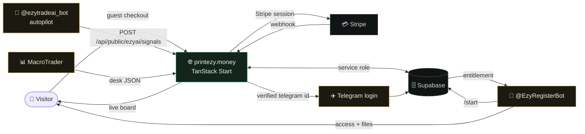

<div align="center">


<br>

# 📈 EzyMap ALGO

**A trading desk that lives inside Telegram — and a website that proves it works.**

Signals, a macro desk, gated ebooks and an AI autopilot, sold through guest-friendly
Stripe checkout and delivered to a Telegram account the buyer never has to type.

<br>

[](https://printezy.money)
[](https://printezy.money/ezyai?tab=live)
[](https://t.me/EzyRegisterBot)


</div>

<br>

|                 |                                                                               |
| --------------- | ----------------------------------------------------------------------------- |
| 🌐 **Live**     | [printezy.money](https://printezy.money)                                      |
| 📡 **Signals**  | [Live autopilot board](https://printezy.money/ezyai?tab=live) — free to watch |
| ☁️ **Hosting**  | [Lovable Cloud](https://lovable.dev) — builds and publishes from `main`       |
| 🗄️ **Backend**  | Supabase (Postgres + Auth + Storage)                                          |
| 💳 **Payments** | Stripe, through Lovable's connector gateway                                   |
| 💬 **Bots**     | `@EzyRegisterBot`, `@ezytradeai_bot`, ASAP-TeleBot, MacroTrader               |

<br>

---

## 🧱 Tech stack

| Piece                                                       | What it does                                                                              |
| ----------------------------------------------------------- | ----------------------------------------------------------------------------------------- |
| **[TanStack Start](https://tanstack.com/start)** (React 19) | File-based routing, server functions, SSR                                                 |
| **[Supabase](https://supabase.com)**                        | Postgres, Auth, and the tables behind leads, checkout, ebook claims, referrals, analytics |
| **[Stripe](https://stripe.com)**                            | Checkout via Lovable's connector gateway — no raw secret keys committed                   |
| **Tailwind CSS v4** + **shadcn/ui**                         | UI, on Radix primitives                                                                   |
| **Framer Motion**                                           | Page and section motion, respects `prefers-reduced-motion`                                |
| **bun**                                                     | The project's real package manager (`bun.lock`)                                           |

> ⚠️ `npm` works for local diagnostics, but its lockfile must never be committed.

---

## 🚀 Getting started

```bash
bun install

bun run dev      # vite dev — http://localhost:8080
bun run build    # production build
bun run lint     # eslint
bun run format   # prettier --write .
```

Copy `.env.development` and the Supabase/Stripe values in `.env` to a local `.env`
if you need to run against your own backend. In production these are injected by
Lovable Cloud at deploy time, never read from a committed file.

---

## 🗂️ Project structure

```
src/
  routes/                 File-based routes (TanStack Start) — see
                           src/routes/README.md for routing conventions.
    index.tsx              Landing page (composes src/components/landing/*)
    macro.tsx               Macro & Crypto desk
    ebooks.$slug.tsx         Standalone ebook detail page
    pricing.tsx, faq.tsx, indicators.tsx, free-channel.tsx, ...
    auth.tsx                 Sign in (Google or email magic link, Supabase Auth)
    dashboard.tsx            Signed-in account page: purchases, ebooks, referral, profile
    account.tsx              Telegram member portal (bot-issued 7-day links, handle + code)
    _authenticated/          Admin-only routes (ads dashboard, site analytics)
  components/
    landing/                 Landing.tsx (Nav, Hero, Pricing, FAQ, Footer, …)
                               and Tools.tsx (TradingView/MT5 product cards)
    EnrollModal.tsx, EbookClaimModal.tsx, EbookDetailsModal.tsx,
    SupportChat.tsx, StickyBuyBar.tsx, ...
  lib/
    *.functions.ts           TanStack server functions (leads, checkout,
                               ebook claims, referrals, support chat, ads)
    bot/                      Telegram bot server logic (menu, enrollment,
                               purchases) — shared with the site's webhook
    catalog.ts                Client-safe product catalogue (SKUs, prices)
    i18n.tsx, translations.ts Six-locale localization (client-only, toggled
                               in the nav, persisted to localStorage)
    rate-limit.server.ts      Fixed-window rate limiter (Supabase-backed)
supabase/
  migrations/                 SQL migrations — run manually in Supabase's
                               SQL editor (no CI migration runner)
```

---

## ✨ How it works



### 🛒 Guest checkout

No account required to buy. An account is created from the Stripe webhook after
payment, with an optional magic-link sign-in offered afterward.

---

### 🔐 Sign in and My account

The header, mobile menu and footer carry a Sign in link (`/auth`: Google or email
magic link, no passwords) that turns into My account (`/dashboard`) once a Supabase
session exists. The dashboard lists the account's `site_purchases`, ebook claims
with download buttons, the referral link and a small profile form.

> ⚠️ Supabase Auth → URL configuration must allow `https://printezy.money/**` and
> the Lovable preview hosts as redirect URLs, because sign-in returns deep links
> such as `/ebooks/<slug>?claim=1`.

<details>
<summary>🎨 <b>Making the Google consent screen say "EzyMap ALGO"</b></summary>

<br>

The name on that screen comes from the OAuth client, not from this repo. Without
your own client, Google shows the raw `<project-ref>.supabase.co` host.

1. Verify `printezy.money` in Google Search Console.
2. Google Cloud Console → **Google Auth Platform** → **Branding**: app name, logo,
   home/privacy/terms URLs, and `printezy.money` as an authorized domain.
3. **Audience** → External, then Publish.
4. **Clients** → create a Web application client with redirect URI
   `https://<project-ref>.supabase.co/auth/v1/callback`.
5. Paste that client id and secret into Lovable Cloud → Auth → Google.

Sign-in only needs the non-sensitive `openid`, `userinfo.email` and
`userinfo.profile` scopes, so no verification review is required. Uploading a logo
does trigger one, though sign-in keeps working while it is pending.

</details>

---

### ✈️ Sign in with Telegram

Everything this site sells is delivered **inside Telegram**, and for a long time
the only thing tying a payment to a Telegram account was the handle the buyer
typed at checkout. One typo, one later rename, or an account with no username at
all, and the purchase sat in `site_purchases` with `granted_at` still null while
the buyer waited on support.

Telegram's Login Widget replaces that typed string with an id **Telegram signs
for**, so delivery has nothing left to get wrong.

| Where               | What it does                                                                                                                         |
| ------------------- | ------------------------------------------------------------------------------------------------------------------------------------ |
| `/auth`             | A third sign-in option beside Google and email. See the two paths below.                                                             |
| `/account`          | One-click sign-in, above the 6-digit code flow. Claims anything already paid for under that handle.                                  |
| `/checkout-success` | "Deliver it to the right account" — attaches the purchase to a verified account, by Stripe session id, with no handle in the middle. |
| `/dashboard`        | A card that links Telegram to the website account and claims every purchase on it.                                                   |

Telegram issues no email, and website accounts are keyed on one — every purchase
is matched to an account by the address Stripe charged. Minting an account from a
Telegram id would mean inventing an email, and the buyer would end up with two
accounts: the invented one they signed in to, and the real one their purchases
landed in. So `/auth` never creates an account. It resolves one of two ways:

- **Linked** (`profiles.telegram_id` matches a website account) → a real Supabase
  session for that account, and on to `/dashboard`. The token handed to the browser
  is the same one a magic link carries in its URL, issued only after Telegram's
  signature proved ownership of the linked account.
- **Not linked yet** → a member-area session instead, and on to `/account`, which is
  keyed on Telegram anyway. Linking is offered on the dashboard, which is what turns
  a visitor into the first case next time.

The signature check lives in `src/lib/telegram-login.server.ts`: HMAC-SHA256 over
Telegram's data-check-string, keyed on `SHA256(bot_token)`, in constant time, with
payloads older than 15 minutes rejected so a captured one is not replayable
forever. Everything else is in `src/lib/telegram-login.functions.ts`; the button
itself is `src/components/TelegramLoginButton.tsx`.

> ⚠️ **Two manual steps, or the button does nothing.** Both are for the _same_
> bot — by default `@EzyRegisterBot`, the one that owns `bot_users` and delivers
> access.
>
> 1. **BotFather → `/setdomain` → `printezy.money`.** Telegram refuses to render
>    the button on a domain the bot has not claimed. Nothing appears, no error.
> 2. **`TELEGRAM_LOGIN_BOT_TOKEN`** in Lovable Cloud, set to that bot's token.
>    The rest of the bot code never sees a raw token — the Lovable connector
>    gateway injects it — but signature verification cannot work without it.
>
> Optional: `TELEGRAM_LOGIN_BOT_USERNAME` if the login bot is not
> `@EzyRegisterBot`.

Until the token is set, `getTelegramLoginConfig` returns `botUsername: null`, no
button is rendered anywhere, and the code-based sign-in carries on as before. The
button also removes itself if Telegram's script fails to load, so a missing
`/setdomain` degrades to the old flow rather than to a dead end.

---

### 📘 Gated ebooks

The PDFs live in the private `ebooks` storage bucket (object key `<slug>.pdf`, see
`supabase/migrations/20260906090000_*`), not under `public/`.
`getEbookDownloadUrl` hands a signed-in user with an approved `ebook_claims` row a
one-hour signed URL. Nothing else can read the bucket.

📥 **To add a PDF:** drop it into the bucket in Lovable Cloud → Storage, then set
`file` on the `EBOOK_PAGES` entry.

🚦 **The approval gate.** Most slugs approve themselves on claim.
`mapping-like-a-pro` is a real gate: the visitor submits full name, Telegram handle
and Vantage account number, the row is saved `pending`, and `notifyVantageClaim`
(`src/lib/bot/ebook-claims.server.ts`) sends Sarah an Approve button. Only her chat
may act on the `ebook:approve:<claimId>` callback.

> ⚠️ That send is awaited, never fire-and-forget. The worker is torn down as soon
> as the response is returned, so an un-awaited notice is silently dropped.

---

### 📮 Support inbox

One numeric Telegram chat id, `support_config.sarah_chat_id`, is the destination
for everything the site sends Sarah:

- 💬 website "Ask Sarah" relays
- 📘 ebook approval requests
- 🎁 trial and purchase requests
- 🤝 referral-conversion notices

`autoRegisterSarah` (`src/lib/bot/sarah.server.ts`) writes it the first time she
messages the bot from `@ezysarah`, then refuses to re-bind, because a released
Telegram handle could otherwise be re-registered by someone else. Moving the inbox
therefore means editing that row by hand.

<details>
<summary>🚨 <b>When a send fails</b></summary>

<br>

Get that number wrong and Telegram rejects every send. This used to be invisible:
the visitor still read "Sent to Sarah" and nobody found out until someone went
looking. Three surfaces now report it.

| Surface               | What you see                                                                      |
| --------------------- | --------------------------------------------------------------------------------- |
| 🖥️ Admin dashboard    | `/site-analytics` shows a red **Support inbox is not delivering** card            |
| 👤 Ebook claim screen | The visitor is offered a direct Telegram link instead of "Sarah will review this" |
| 🗄️ Database           | `support_config.sarah_send_health` holds the failing send, timestamp and error    |

`recordSarahSendFailure` writes that row. The next successful send calls
`clearSarahSendFailure`, and the card clears itself.

🔍 **Diagnosing a wrong id.** `support_messages.sarah_message_id` is `NULL` on every
row while the id is wrong, and populated once a send lands. Cross-check the value
against `bot_users.telegram_id` for `ezysarah`, which the webhook writes straight
from a real Telegram update and is therefore authoritative.

</details>

---

### 🔗 Telegram portal links

Every "My account" button the bot sends is a fresh 7-day `member_sessions` row
(`accountLinkFor`). The permanent `enrollments.portal_token` is only a Stripe
correlation id and is no longer accepted as a credential.

---

### 🌍 Six locales

`en` · `ms` · `zh` · `hi` · `ar` · `sw` — switcher in the nav, see
`src/lib/i18n.tsx`.

Every public page has a real Malay URL under `/ms/*` (`src/routes/ms/*` re-export
the English page component with a Malay `head()` from `src/lib/seo.ts`), and
reciprocal hreflang is emitted per route and in `/sitemap.xml`. The other four are
a client-side preview with no URL of their own.

> ⚠️ `TranslationKey` is derived from the `en` block, so a new key must be added to
> all six blocks in `src/lib/translations.ts`.

Ebook page copy is localized via the `ms` field on each `EBOOK_PAGES` entry
(`src/lib/ebooks.ts`). The PDFs and the Macro desk data (`src/lib/macro-desk.ts`)
stay English.

📗 **Trading terms stay in English in every locale.** Traders learn this
vocabulary in English, and translating it makes copy harder to follow, not
easier — so `signal`, `entry`, `stop loss`, `take profit`, `target`, `support`,
`resistance`, `breakout`, `trend`, `scalp`, `intraday`, `swing`, `timeframe`,
`indicator`, `macro`, `bullish`/`bearish`, `hawkish`/`dovish`, `forex`,
`crypto`, `pair`, `drawdown`, `position`, `chart`, `level`, `setup` and `pip`
are left as-is inside the translated sentence. Two things are deliberately
_not_ converted: words that carry a second everyday meaning in that language
(Arabic `دعم` is also customer support, `دخول` is also signing in), and the
`match` arrays in the reply-book layers — those are the phrases a visitor
types in their own language, so translating them would stop the bot
recognising them. Button labels are safe: `localize` keeps the English
entry's keyword and URL and swaps only the visible text.

---

### 🤖 EzyAI PRO checkout

`ezyai_pro_{1m,6m,1y}` SKUs go through the same guest Stripe checkout as every
other product. The webhook records the `site_purchases` row, then writes an
`ezyai_entitlements` row keyed on the Telegram handle typed at checkout instead of
granting an EzyRegister enrollment.

`@ezytradeai_bot` pulls unclaimed rows for a handle from
`GET/POST /api/public/ezyai/entitlements` (bearer key `EZYAI_ENTITLEMENT_KEY`, same
value as the bot's `EZYAI_SITE_KEY`) and activates PRO itself. See
`src/lib/ezyai/entitlements.server.ts`.

🎟️ **Redeem codes.** Every EzyAI checkout also mints one (`EZY-XXXX-XXXX`,
`src/lib/ezyai/redeem-code.ts`) stored on the Stripe session and in the payment
description, so it shows on the success page, the Stripe receipt and My account. A
buyer whose handle didn't match sends `/redeem <code>` to the bot, which looks the
row up with `GET /api/public/ezyai/entitlements?code=<code>`.

> ⚠️ Stripe needs one Price per SKU with `lookup_key` = SKU, in both sandbox and
> live.

---

### 🛰️ EzyAI autopilot signal board

`/ezyai` is three tabs: **Live signals**, **Performance** and **About EzyAI** (the
marketing that used to be the whole page). The first two are fed by the
autopilot running on the admin's own account.

The board is **public on this site by design** — anyone can watch the desk work,
which is the proof that sells PRO. The paywall stays where it always was, inside
the bot, on the alerts that arrive while a trade is still worth taking.

A card carries status, entry zone, SL, TP1/TP2, R:R and the setup score, and it
stays on the board until the trade actually closes at target, break-even or stop
— nothing is quietly removed. The rail under each card maps the last reported
price onto the stop → target span, so both directions read left-to-right and
"further right is better" whichever way the trade points.

#### The bot contract

```
POST /api/public/ezyai/signals      Authorization: Bearer <EZYAI_SIGNAL_KEY>
```

Three shapes, all the same call. Every field except `external_id` is optional,
and a field the payload omits keeps whatever it already had:

```jsonc
// open
{ "external_id": "auto-8842", "symbol": "XAUUSD", "direction": "buy",
  "status": "pending", "setup": "London continuation", "timeframe": "M15",
  "entry_low": 4590.2, "entry_high": 4593.0, "stop_price": 4585.0,
  "tp1": 4604.0, "tp2": 4612.0, "rr": 2.4, "setup_score": 82 }

// tick — as often as you like while it runs
{ "external_id": "auto-8842", "status": "running", "last_price": 4597.1 }

// close
{ "external_id": "auto-8842", "status": "tp", "result_r": 2.4, "result_pips": 138 }
```

| Field         | Notes                                                                        |
| ------------- | ---------------------------------------------------------------------------- |
| `external_id` | The bot's own id for the trade. Makes every push idempotent.                 |
| `status`      | `pending` · `running` · `tp` · `be` · `sl` · `cancelled`                     |
| `direction`   | `buy` · `sell`                                                               |
| `setup_score` | 0–100, rendered as the ring on the card                                      |
| `result_r`    | Realised R: `+2.4` at target, `-1` at stop. Drives every performance number. |
| `closed_at`   | Filled in automatically on a closing status if omitted                       |

**A ready-made client is in this repo:** [`docs/ezyai_signal_client.py`](./docs/ezyai_signal_client.py).
Standard library only, so it adds no dependency to the bot. Drop it in, set
`EZYAI_SIGNAL_KEY`, and call it from wherever the autopilot already decides to
open, move and close a trade:

```python
from ezyai_signal_client import open_signal, tick, close_signal

open_signal("auto-8842", "XAUUSD", "buy", status="running",
            entry_low=4590.2, entry_high=4593.0, stop_price=4585.0,
            tp1=4604.0, tp2=4612.0, rr=2.4, setup_score=82,
            setup="London continuation", timeframe="M15")

tick("auto-8842", 4597.1)                        # while it runs

close_signal("auto-8842", "tp", result_r=2.4)    # at target / break-even / stop
```

Nothing there raises: a failed push returns `ok=False` and logs, because the
board is a shop window and must never be able to take the bot down with it.
Running the file directly (`python ezyai_signal_client.py`) fires a probe signal
and cancels it again, which is the quickest way to prove the key works.

Batch up to 50 with `{ "signals": [ ... ] }`. A mixed batch answers **207** with
a per-signal `results` array, so one malformed row cannot lose the other
forty-nine. `GET` the same URL returns the live board for reconciliation.

> ⚠️ Set **`EZYAI_SIGNAL_KEY`** in Lovable Cloud. It falls back to
> `EZYAI_ENTITLEMENT_KEY` if unset, so the bridge works with one secret and can
> be split onto its own later without a code change. While neither is set the
> endpoint answers 503 and the board simply stays empty.
>
> Secrets bind at **deploy** time, not at save time — a key added after the last
> deploy is not in the running site's environment until the project deploys
> again.

#### 🩺 When the key is refused

Open this in a browser — no key, no tooling, nothing secret comes back:

```
https://printezy.money/api/public/ezyai/signals?diagnose=1
```

```jsonc
{
  "configured": true,
  "compared_against": "EZYAI_SIGNAL_KEY", // ← the variable actually being checked
  "signal_key_present": true,
  "entitlement_key_present": true,
  "expected_fingerprint": "118ccb6a",
} // first 4 bytes of SHA-256
```

A 401 carries the same three facts, plus the fingerprint of what you sent, so
the two can be compared without either of them being printed:

| What you see                                | What it means                                                        |
| ------------------------------------------- | -------------------------------------------------------------------- |
| `"signal_key_present": false`               | The signal key is not in the deployed environment — **deploy again** |
| `compared_against: "EZYAI_ENTITLEMENT_KEY"` | The fallback is doing the work; the signal key never arrived         |
| Fingerprints differ                         | Two different secrets — the bot's copy is stale, or was re-generated |
| `"presented_fingerprint": "none"`           | No `Authorization: Bearer …` header reached the site                 |
| 503                                         | Neither variable is bound at all                                     |

Surrounding whitespace and one matched pair of quotes are stripped from both
sides before comparing, so a secret pasted into a dashboard as `"abc"` still
authenticates a bot sending `abc`.

Performance counts closed signals only; `cancelled` never counts. Win rate is
wins over wins + losses — **break-even is excluded from the denominator** rather
than counted as half a win, so the number cannot be flattered by moving stops to
entry.

Note the ingest is an explicit update-or-insert, not an upsert: Postgres builds
the candidate row and checks its NOT NULL columns _before_ it notices the
conflict, so an upsert of a price tick — which carries no `symbol` — is rejected
even though the row it means to update already exists.

Code: `src/lib/ezyai/signals.ts` (types + the arithmetic, isomorphic),
`signals.server.ts` (database), `signals.functions.ts` (what the page reads),
`src/routes/api/public/ezyai/signals.ts` (the bridge),
`src/components/ezyai/` (the cards and the performance panel).

---

### 📊 Macro desk data

The economic calendar on `/macro` is read from ForexFactory's weekly feed
(`src/lib/macro-calendar.functions.ts`).

Central bank rates, recession odds, decision dates and the two trend sparklines
come from the MacroTrader bot's `GET /api/desk`
(`src/lib/macro-live.functions.ts`; env `MACRO_BOT_URL` + `MACRO_BOT_KEY`, the
latter equal to the bot's `SITE_API_KEY`), so the site and the Telegram bot always
show the same numbers.

Both are cached in `macro_calendar_cache` and fall back to the last good copy. With
the bridge unset the cards show the seeded copy with a "sample data" note.

---

### 🛡️ Rate limiting

`checkCheckout`, `saveLead`, and the support chat endpoints are protected by a
Supabase-backed fixed-window limiter that fails open, so a limiter outage never
blocks a legitimate purchase or message.

---

### 🔏 SECURITY DEFINER functions

Every function of this kind ships with an explicit
`REVOKE ... FROM PUBLIC, anon, authenticated` and a `GRANT` only to the role that
calls it. See `supabase/migrations/`.

---

## 🔀 Related repos

### [EzyMap](https://github.com/printezy247/EzyMap)

The MT5/TradingView indicator source, the Telegram bot, and `EzyMapLicenseServer`
(the separate Xendit-based licensing backend for the MT5 tools).

> The website and the Telegram bot are intentionally separate systems that don't
> share purchase data. A website sale notifies the team over Telegram for manual
> reconciliation against the bot's own product/license system.

### [EzyAi](https://github.com/tradernonymous/EzyAi)

The `@ezytradeai_bot` Telegram bot (Python): on-demand analysis, live watch alerts,
fundamentals and autopilot signals, with Free/PRO tiers. PRO is billed two ways —
inside Telegram (the bot's own Stripe Checkout, Telegram Stars, or USDT with admin
approval), or by card on `/ezyai` here, delivered through the `ezyai_entitlements`
bridge above. The bot keeps its own plan state; the website never reads it.

### [ASAP-TeleBot](https://github.com/printezy247/ASAP-TeleBot)

The button-driven product bot (Python): signal-community tiers, the paid tool
catalog, USDT/Stripe/Telegram Stars payments and MT5 trial licensing.

> ⚠️ It runs its own admin approvals against `EZYMAP_ADMIN_CHAT_ID`, a separate
> setting from this site's `sarah_chat_id`. If the same person admins both, the two
> numbers should match.

---

## 💛 Sponsor

<div align="center">


</div>

Everything above runs on free public data feeds and a single small Cloudflare
Worker. No paid market API, no scraped terminal, no ghost-written track record —
the signal board is fed by the same autopilot that trades the maintainer's own
account, and the win rate on `/ezyai` counts break-even trades honestly rather
than the flattering way.

If that is the sort of thing you would like more of, sponsorship goes to the
parts that cost money rather than the parts that are fun:

| What                                | Why it costs                                                                                                                                              |
| ----------------------------------- | --------------------------------------------------------------------------------------------------------------------------------------------------------- |
| 📡 **Market data with actuals**     | ForexFactory's free feed publishes forecast and previous but never the released number. A feed that does is the single biggest upgrade to the macro desk. |
| 🖥️ **A dedicated VPS for the bots** | Four Telegram bots on one hobby box is a single point of failure for every delivery on this list.                                                         |
| 🌍 **Native translators**           | Six locales ship today; four of them were translated by a machine and deserve a human pass.                                                               |
| 🧪 **A staging Supabase project**   | Every migration here is applied to production because there is nowhere else to apply it.                                                                  |

<div align="center">

<br>

[](https://github.com/sponsors/printezy247)
[](https://t.me/ezymap)

<sub>Or just open the board and watch it work — that costs nothing and helps most.</sub>

</div>

---

## 🚢 Deployment

Changes are pushed to `main`, built by Lovable Cloud, and published via
`deploy_project`. There is no separate staging environment, so verify locally
(`bun run dev` plus a manual pass, or Playwright against `127.0.0.1`) before
pushing.

> ⚠️ `deploy_project` returns `pending` and does not always land. When the Lovable
> editor still reports the project as unpublished, open it and click
> **Publish → Update**, then hard-refresh printezy.money.

💡 Anything stored in the database — the support inbox id, entitlement rows, cached
macro payloads — takes effect immediately and needs no publish at all.
